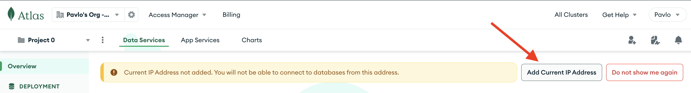
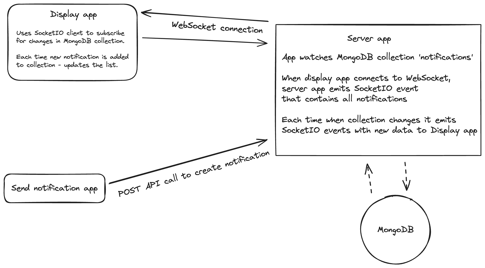

> [!IMPORTANT]
> You will need Docker installed on your computer

> [!IMPORTANT]
> Server app uses MongoDB Atlas Cluster <br>
>
> BEFORE you start, please sign in to: <br>
> https://account.mongodb.com/account/login?signedOut=true <br>
>
> Creadentials: <br>
> ```risini7248@picdv.com``` <br>
> ```testPASSWORD111!```
>
> You will need to add your IP address to whitelist here:<br>
> 
>
> [!IMPORTANT]
>  Please keep in mind that your IP address may change when you switch WI-FI connection or reset you router

## How to run applications


To run application open terminal in root directory and paste code: <br>
### `sh run.sh`

Display screen will be available here:<br> http://localhost:3001/ <br>
Sending screen will be available here:<br> http://localhost:3002/

## Project Architecture:

